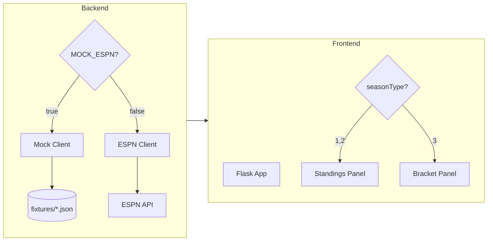

# Playoff Bracket and Mock Data Infrastructure

## Overview

Add playoff bracket display during postseason (replacing standings) with ASCII-style visual bracket, plus a robust mock data infrastructure for testing and local development.

## Todos

- [ ] Create JSON fixture files for all scenarios (regular, playoffs, standings)
- [ ] Add MOCK_ESPN env var and fixture loading to backend
- [ ] Add /playoffs/bracket endpoint with PlayoffBracket model
- [ ] Add ASCII bracket panel to home.html for postseason
- [ ] Add bracket styling to teletext.css
- [ ] Add unit tests for playoffs and mock infrastructure
- [ ] Add mock-up and test-mock Makefile targets

## Architecture Overview



## Part 1: Mock Data Infrastructure

### 1.1 Create Fixture Files

Create `backend/src/fixtures/` directory with JSON files:

| File | Content |
|------|---------|
| `regular_season.json` | Week 15 regular season with mix of final/live/upcoming games |
| `postseason_wildcard.json` | Wild Card round with 6 games, some final, some upcoming |
| `postseason_divisional.json` | Divisional round with 4 games |
| `postseason_conference.json` | Conference championships (2 games) |
| `postseason_superbowl.json` | Super Bowl game |
| `standings.json` | Full 32-team standings by division |
| `playoff_seeds.json` | AFC/NFC seeds 1-7 with team info |

### 1.2 Mock Data Client

Add to `backend/src/main.py`:

```python
MOCK_ESPN = os.getenv("MOCK_ESPN", "").lower() in ("1", "true")

def _load_fixture(name: str) -> dict:
    fixture_path = Path(__file__).parent / "fixtures" / f"{name}.json"
    return json.loads(fixture_path.read_text())
```

Modify `_get_weekly_games()` and `_get_live_standings()` to check `MOCK_ESPN` and load fixtures instead of calling ESPN.

### 1.3 Fixture Selection Logic

Add query parameter `?fixture=wildcard` to override which fixture is loaded (for testing different scenarios):

```python
@app.get("/games/weekly")
def get_weekly_games(
    fixture: str | None = Query(default=None, description="Mock fixture name"),
    ...
):
    if MOCK_ESPN:
        fixture_name = fixture or _detect_fixture_from_params(year, week, seasonType)
        return _load_fixture(fixture_name)["games"]
```

## Part 2: Playoff Bracket Feature

### 2.1 New Backend Endpoint

Add `/playoffs/bracket` endpoint to `backend/src/main.py`:

```python
class PlayoffGame(BaseModel):
    round: str  # "Wild Card", "Divisional", "Conference", "Super Bowl"
    conference: str  # "AFC", "NFC", or "Super Bowl"
    home_team: str
    home_seed: int
    home_score: int | None
    away_team: str
    away_seed: int
    away_score: int | None
    status: str  # "final", "live", "upcoming"
    winner: str | None

class PlayoffBracket(BaseModel):
    season_year: int
    afc_seeds: list[dict]  # [{seed: 1, team: "Chiefs", eliminated: False}, ...]
    nfc_seeds: list[dict]
    games: list[PlayoffGame]
```

### 2.2 Frontend Bracket Template

Create new template section in `frontend/src/templates/home.html` that replaces standings during postseason:

```html

  <!-- Playoff Bracket -->
  <div class="ttx-panel">
    <h2>Playoff Bracket</h2>
    <pre class="ttx-bracket">
AFC                           NFC
─────────────────────────────────────────
(1) Chiefs ────┐
               ├── Chiefs ──┐
(4) Texans ────┘            │
                            ├── AFC Champ
(2) Bills ─────┐            │
               ├── Bills ───┘
(3) Ravens ────┘

... (similar for NFC and Super Bowl)
    </pre>
  </div>

  <!-- Regular Standings -->
  ...

```

### 2.3 Bracket Rendering Logic

Add bracket rendering helper in `frontend/src/app.py`:

```python
def render_bracket(bracket_data: dict) -> str:
    """Generate ASCII bracket from playoff data."""
    # Build bracket tree structure
    # Return formatted string for template
```

### 2.4 CSS for Bracket

Add to `frontend/src/static/teletext.css`:

```css
.ttx-bracket {
    font-family: inherit;
    white-space: pre;
    overflow-x: auto;
    font-size: 12px;
    line-height: 1.4;
}
.ttx-bracket .winner { color: var(--accent); }
.ttx-bracket .eliminated { color: #666; text-decoration: line-through; }
```

## Part 3: Testing

### 3.1 Unit Tests

Add tests in `backend/src/utest/test_playoffs.py`:

- Test bracket data extraction from ESPN format
- Test fixture loading
- Test bracket rendering

### 3.2 Frontend Tests

Add postseason tests in `frontend/src/utest/test_app.py`:

- Test bracket panel appears when `seasonType=3`
- Test standings panel appears when `seasonType!=3`

### 3.3 Makefile Target

Add to `Makefile`:

```makefile
mock-up:
	MOCK_ESPN=true $(MAKE) up

test-mock:
	MOCK_ESPN=true $(MAKE) test
```

## File Changes Summary

| File | Change |
|------|--------|
| `backend/src/fixtures/*.json` | New fixture files (7 files) |
| `backend/src/main.py` | Add mock client, playoff endpoint |
| `backend/src/utest/test_playoffs.py` | New test file |
| `frontend/src/app.py` | Add bracket fetching, rendering |
| `frontend/src/templates/home.html` | Add bracket panel |
| `frontend/src/static/teletext.css` | Add bracket styles |
| `frontend/src/utest/test_app.py` | Add postseason tests |
| `Makefile` | Add mock targets |

