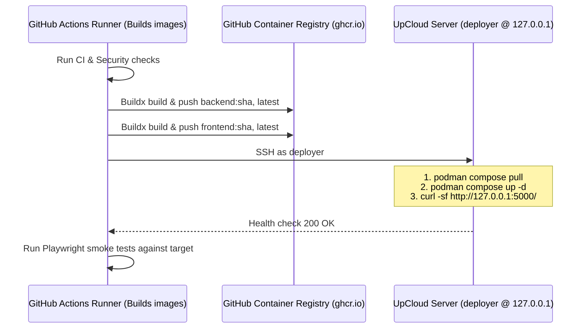

# UpCloud Migration Plan: Rootless Podman + Caddy + UFW

## 1. Environment & Architecture Overview

The target environment is a **1 vCPU / 1 GB RAM UpCloud Ubuntu Cloud Server**:
- **Target OS**: Ubuntu Linux
- **Resources**: 1 vCPU, 1 GB RAM (Strict memory & CPU budget: all image builds offloaded to GitHub Actions)
- **Container Engine**: Rootless Podman running under the `deployer` user
- **Reverse Proxy / TLS**: Caddy (running on host, managing Let's Encrypt TLS)
- **Firewall**: UFW (ports 22, 80, 443 open; ports 5000 & 8000 closed to public)
- **AWS Lightsail**: Stays running in parallel during migration for zero risk.

```
Internet (Ports 80, 443)
       │
       ▼
   UFW Firewall (Allow 22, 80, 443; Deny direct access to 5000/8000)
       │
       ▼
  Caddy Reverse Proxy (Host, Port 80/443)
       │  Reverse proxy to http://127.0.0.1:5000
       │  (Handles automatic Let's Encrypt TLS & HTTP->HTTPS redirect)
       ▼
┌─────────────────────────────────────────────────────────────┐
│  Rootless Podman (deployer user)                            │
│  Network: light-score-net                                   │
│                                                             │
│   Frontend Container (Flask/Gunicorn, 2 workers)            │
│   - Host Port: 127.0.0.1:5000 -> Container: 5000           │
│   - Env: BACKEND_URL=http://backend:8000                    │
│   - Memory footprint: ~60-80 MB                             │
│         │                                                   │
│         ▼                                                   │
│   Backend Container (FastAPI/Uvicorn)                       │
│   - Container Port: 8000 (No host port published)           │
│   - Outbound: HTTPS to ESPN APIs                            │
│   - Memory footprint: ~40-60 MB                             │
└─────────────────────────────────────────────────────────────┘
  Total Stack Memory: ~150-180 MB (Well within 1 GB RAM budget)
```

---

## 2. Server Sizing & Resource Optimization Strategy

Because the server has **1 CPU and 1 GB RAM**:
1. **Never Build on Server**: Running `pip install`, compiling C-extensions, or building Docker images on 1 GB RAM frequently triggers the Linux OOM (Out Of Memory) killer or freezes the server.
2. **Build in GitHub Actions**: GitHub Actions runners provide 2–4 vCPUs and 7–16 GB RAM. We build both backend and frontend images in CI, tag them with the commit SHA, and push them to GitHub Container Registry (`ghcr.io`).
3. **Lightweight Deployment**: The UpCloud server only runs `podman pull` of compressed image layers and restarts the containers.
4. **Log Constraints**: Configure container log rotation (`max-size: 10m`, `max-file: 3`) to prevent filling the disk.

---

## 3. Deployer User & Rootless Podman Configuration

### 3.1 Enable User Linger (Mandatory for Rootless Containers)
By default, systemd terminates user processes and containers when an SSH session disconnects. Enabling linger ensures rootless Podman containers continue running in the background and auto-start on server boot:

```bash
sudo loginctl enable-linger deployer
```

### 3.2 Verify subuid and subgid
Ensure the `deployer` user has subuids allocated for rootless namespaces:
```bash
grep deployer /etc/subuid /etc/subgid
# Expected output: deployer:100000:65536 (or similar range)
```

### 3.3 Port Binding Permissions
Since port `5000` is unprivileged (> 1024), rootless Podman can bind to `127.0.0.1:5000` directly without requiring root privileges or sysctl adjustments.

---

## 4. Production Stack Definition (`compose.prod.yaml`)

Placed in `/home/deployer/light-score/compose.prod.yaml`:

```yaml
services:
  backend:
    image: ghcr.io/juusoi/light-score-backend:latest
    container_name: light-score-backend
    restart: unless-stopped
    expose:
      - "8000"
    environment:
      - MOCK_ESPN=false
    networks:
      - light-score-net
    logging:
      driver: "k8s-file"
      options:
        max-size: "10m"
        max-file: "3"

  frontend:
    image: ghcr.io/juusoi/light-score-frontend:latest
    container_name: light-score-frontend
    restart: unless-stopped
    ports:
      # Bound to loopback interface only — not accessible from outside the server
      - "127.0.0.1:5000:5000"
    environment:
      - BACKEND_URL=http://backend:8000
    depends_on:
      - backend
    networks:
      - light-score-net
    logging:
      driver: "k8s-file"
      options:
        max-size: "10m"
        max-file: "3"

networks:
  light-score-net:
    name: light-score-net
```

---

## 5. Host Configuration: Caddy & UFW

### 5.1 Caddyfile (`/etc/caddy/Caddyfile`)
```caddyfile
{$DOMAIN_NAME:light-score.com} {
    encode gzip zstd

    reverse_proxy 127.0.0.1:5000 {
        header_up Host {host}
        header_up X-Real-IP {remote_host}
        header_up X-Forwarded-For {remote_host}
        header_up X-Forwarded-Proto {scheme}
    }

    # Security headers
    header {
        X-Content-Type-Options "nosniff"
        X-Frame-Options "DENY"
        Referrer-Policy "strict-origin-when-cross-origin"
    }

    log {
        output file /var/log/caddy/light-score.access.log {
            roll_size 10mb
            roll_keep 3
        }
    }
}
```

### 5.2 UFW Firewall Rules
Verify UFW only allows ports 22, 80, and 443:
```bash
sudo ufw status verbose
```
Direct access to ports `5000` and `8000` from the internet is completely prevented by both UFW and the loopback binding (`127.0.0.1:5000`).

---

## 6. GitHub Actions CI/CD Pipeline (`deploy-upcloud.yaml`)

Runs in parallel with Lightsail. Lightsail remains completely unaffected.



### Required GitHub Secrets:
- `UPCLOUD_HOST`: UpCloud server IP.
- `UPCLOUD_USER`: `deployer`
- `UPCLOUD_SSH_KEY`: SSH private key for `deployer`.

---

## 7. Zero-Downtime Migration & Cutover Checklist

1. **Step 1: One-time Server Prep** (as `deployer`):
   ```bash
   mkdir -p ~/light-score
   # Verify linger is enabled
   loginctl show-user deployer | grep Linger
   ```
2. **Step 2: Test ESPN API Outbound Connectivity**:
   ```bash
   curl -I "https://cdn.espn.com/core/nfl/standings?xhr=1"
   ```
3. **Step 3: Initial Manual Image Pull & Verification**:
   ```bash
   cd ~/light-score
   podman compose -f compose.prod.yaml pull
   podman compose -f compose.prod.yaml up -d
   curl -I http://127.0.0.1:5000/
   ```
4. **Step 4: Caddy Staging / Direct Verification**:
   - Test via Caddy with a test subdomain (e.g. `upcloud.domain.com`) or curl host header.
   - Run Playwright E2E smoke tests against the UpCloud instance.
5. **Step 5: DNS Cutover**:
   - Lower DNS TTL to 300s.
   - Update DNS A record to UpCloud IP.
   - Caddy automatically secures Let's Encrypt certificates.
   - Both Lightsail and UpCloud handle traffic gracefully during DNS propagation.
6. **Step 6: Burn-In (48h) & Lightsail Decommission**:
   - Monitor UpCloud performance.
   - Instant rollback available by flipping DNS back to Lightsail if needed.
   - Once validated, decommission Lightsail to stop AWS charges.
